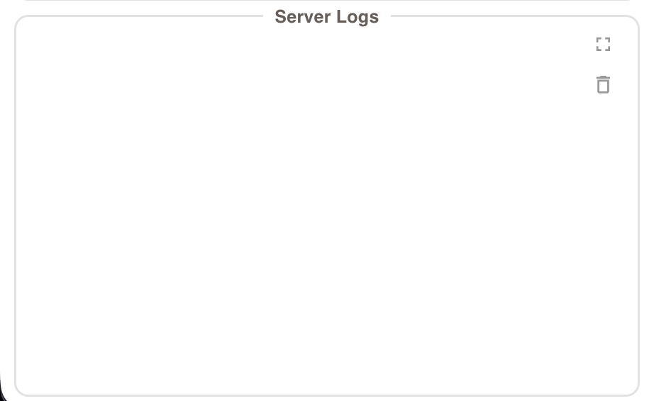

# Server Logging

  
   
  <em>Server Logs</em>

The server should log any outgoing or incoming message to give visibitily into the connection status and system state.

Included within the logs should be the following message types:
1. Mode Actions
2. Configuration Actions
3. Queue Actions
4. Scheduler Actions

## 1. Mode Logging

The server should log any switch in the mode and the following transmissions to nodes.

### Setting SIM Mode
This is triggered upon clicking the "Sim Mode" button within the header

*Format:*
"=============== SET: SIMULATION ==============="
"[SERVER -> Node 1]: {json sent}"
"[SERVER -> Node 2]: {json sent}"
...
"[SERVER -> Node 3]: {json sent}"

### Setting TEST Mode
This is triggered upon clicking the "Test Mode" or "Dummy Mode" buttons within the header

*Format:*
"=============== SET: TESTING ==============="
"[SERVER -> Node 1]: {json sent}"
"[SERVER -> Node 2]: {json sent}"
...
"[SERVER -> Node 3]: {json sent}"

## 2. Configuration Logging
The configuration actions should be logged. These include all configuration methods within the sidebar squares:
- Restroom
- Shy Pee-er Population
- Middle Toilet as First Choice
- Restroom Conditions
- +1/-1 Cleanliness buttons
- Send Maitenance buttons

*Format:*
"[CONFIGURATION]: {config_type} changed; {prev_state} -> {new_state}"

ex:
"[CONFIGURATION]: Shy Pee-er Population changed; 5% -> 2%"

## 3. Queue Actions
The queue actions should be logged. This includes adding a user to the queue, or clearing the queue 

*Format:*
Adding a user:
"[QUEUE]: Added (use: {user type "pee" | "poo"}, duration {duration_s})"
ex: 
"[QUEUE]: Added (use: pee, duration: 2.0s)"

Clearing the queue:
"[QUEUE]: Cleared Queue"

## 4. Scheduler Actions
The scheduler actions of sending a user to a node (SIM mode), or to a toilet (TEST mode) should be logged.

TESTING MODE
*Format:*
"[SCHEDULER]: {user_id} -> {toilet_id}"

SIMULATION MODE
*Format:*
"[SCHEDULER]: {user_id} -> {toilet_id}"
"[SERVER -> Node {n}]: {user_id} -> {toilet_id}"

_note:_
_- for the simulation mode, only one additional line should be added to the simulation log, which indicates which node the server is sending which user_

# Delimination & Escaping
Between each distinct message, the 

Example log output:

"=============== SET: SIMULATION ==============="
"[SERVER -> Node 1]: {json sent}"
"[SERVER -> Node 2]: {json sent}"
"[SERVER -> Node 3]: {json sent}"
"[SERVER -> Node 4]: {json sent}"
"[SERVER -> Node 5]: {json sent}"
"[SERVER -> Node 6]: {json sent}"
"/n"
"[QUEUE]: Added (use: {user type "pee" | "poo"}, duration {duration_s})"
"/n"
"[QUEUE]: Added (use: {user type "pee" | "poo"}, duration {duration_s})"
"/n"
"[QUEUE]: Added (use: {user type "pee" | "poo"}, duration {duration_s})"
"/n"
"[SCHEDULER]: {user_id} -> {toilet_id}"
"[SERVER -> Node {n}]: {user_id} -> {toilet_id}"
"/n"
"[SCHEDULER]: {user_id} -> {toilet_id}"
"[SERVER -> Node {n}]: {user_id} -> {toilet_id}"
"/n"
"[CONFIGURATION]: Shy Pee-er Population changed; 5% -> 2%"
"/n"
"[QUEUE]: Cleared Queue"
"/n"
"=============== SET: TESTING ==============="
"[SERVER -> Node 1]: {json sent}"
"[SERVER -> Node 2]: {json sent}"
"[SERVER -> Node 3]: {json sent}"
"[SERVER -> Node 4]: {json sent}"
"[SERVER -> Node 5]: {json sent}"
"[SERVER -> Node 6]: {json sent}"