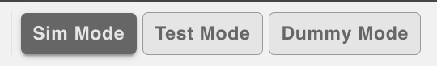

# Modes

  
   
  <em>Header Modes</em>

## Modes
1. Simulation (Sim Mode) - main functionality of the application - digital twin simulation of the Poolantir System
2. Testbench (Test Mode) - allows the user to test and configure the ESP32 nodes
3. Dummy (Dummy Mode) - allows the user to play with the Poolantir Simulation interface without the attached ESP32s

## Command Messages

Set ESP32 nodes to "TEST"
- Clicking "Test Mode" Button
- Clicking "Dummy Mode" Button

Set ESP32 nodes "SIM"
- Clicking "Sim Mode" Button