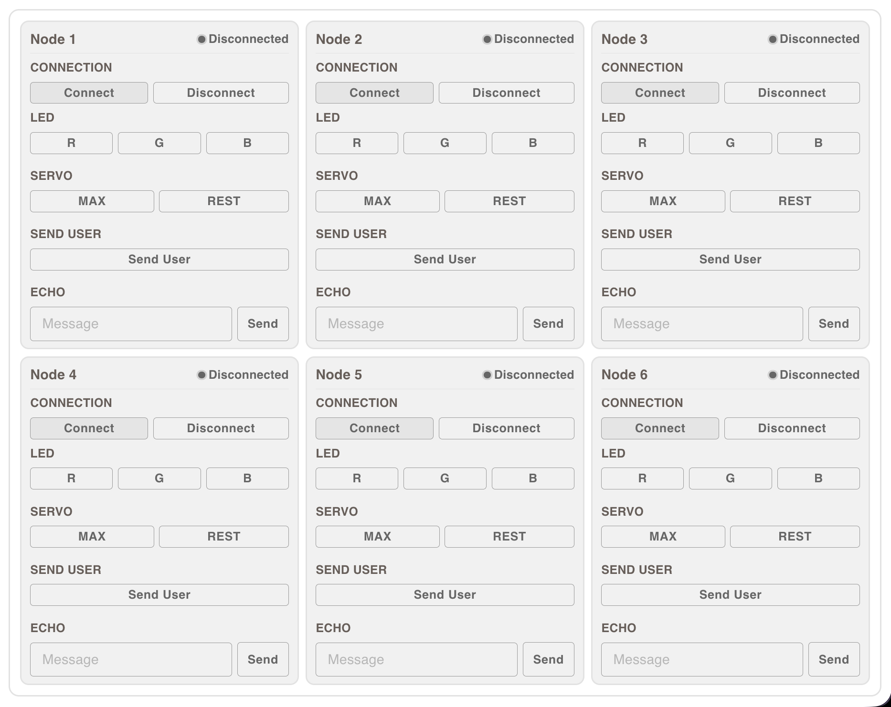

# Frontend Testbench

## 2. Testbench
Current Testbench

  
   
  <em>Testbench/em>

Current Functionality:
- Connection - Connect/Disconnect
- Toggle LED - R/G/G
- Set Servo - MAX/REST
- Send User - random duration and random id
- Echo - send a message and receive a response

Wanted Functionality:
- Connection - Connect/Disconnect
- Toggle LED - R/G/G
- Set Servo - MAX/REST
- Send User - random duration and random id
- Send Queue - tells the ESP32 to run a test queue on the node
- Echo - send a message and receive a response
- Set Flash (servo ramp) - tells the ESP32 to set a variable in flash
- Set Flash (in range mm) - tells the ESP32 to set a variable in flash

To implement the new testbench, see the commands specified within [COMMANDS.md](COMMANDS.md)
 
## HTML Composition
Keep the current composition of the individual node testbenches as depicted within the image provided.
1. add the "Send Queue" button to the same horizontal flexbox as the "Send User". Replace the label from "Send User" to "Schedule Usage"
2. add a section above all of the testbenches with input fields for flashing variables across all nodes that are connected
    - label "Flash All Nodes"
    - input field: lable "Servo Ramp" -> sends the flash message to save new servo ramp param
    - input field: lable "In-Range MM" -> sends the flash message to save new in range mm param

The new section should be placed directly above all testbenches for nodes, and interacting with these params will attempt to send messages to flash nodes in a sequential fashion (1, 2, 3, 4, 5, 6). Note that nodes may not be connected.

## Firmware Parity (main.cpp → COMMANDS.md)

The frontend now emits COMMANDS.md-shaped JSON. Current `main.cpp` does **not** parse these shapes yet. Mapping for firmware update:

| Frontend sends (COMMANDS.md) | main.cpp currently expects | Change needed |
|------------------------------|---------------------------|---------------|
| `SIM` / `NEW` / `{duration_s: float}` | `USAGE` / `DURATION_S` / numeric action | Rename command branch `USAGE` → `SIM`, type `DURATION_S` → `NEW`, read `action.duration_s` |
| `TEST` / `QUEUE` / `RUN` | `TEST` / `SIM` / `RUN` | Rename type branch `SIM` → `QUEUE` |
| `FLASH` / `IN_RANGE` / int | (none) | Add `FLASH` command handler; write `IN_RANGE_MM` to NVS/global |
| `FLASH` / `SERVO_RAMP` / int | (none) | Add `FLASH` command handler; write `kMoveMs` to NVS/global |

Track in a follow-up PR.